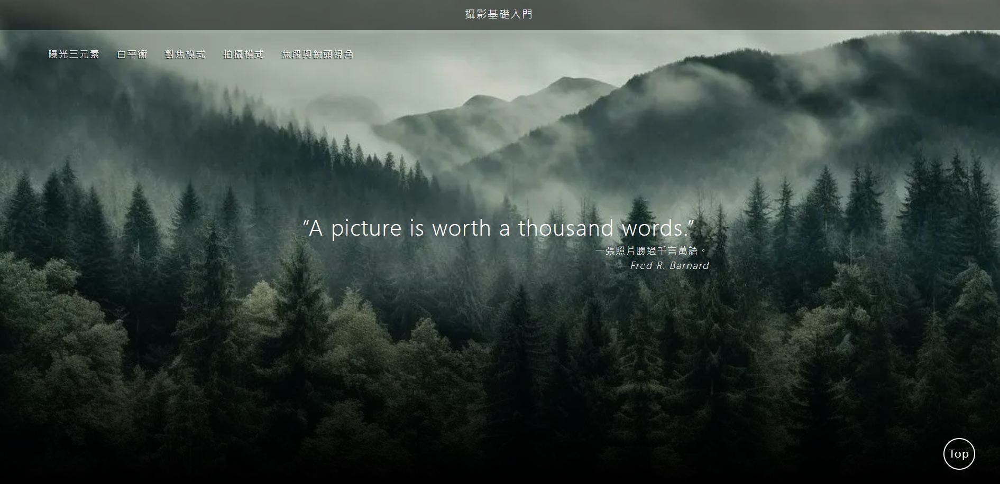

# 📷 Project Photography

## 專案簡介

因為個人對攝影有興趣，製作了這個 **攝影基礎入門教學網站**，目的是整理常見的攝影知識與技巧，並同時嘗試不同的排版與網頁呈現方式。  
網站內容涵蓋攝影基礎理論、拍攝模式、曝光三元素、白平衡、焦段等主題，適合初學者快速入門。

**網站連結** 👉 [點此查看](https://moriciao.github.io/project-photography/)

---

## 📌 主要功能

- **攝影基礎知識介紹**  
  清楚的文字與圖片說明，幫助初學者理解拍攝概念。
- **多元排版嘗試**  
  使用不同的版面配置、圖片排列方式，增添瀏覽的趣味性。

---

## 🛠️ 使用技術

- **React** - 元件化開發與狀態管理
- **Tailwind CSS** - 快速建立響應式排版與樣式

---

## 💡 製作動機

> 「攝影不只是按下快門，更是觀察與構圖的藝術。」

## 我希望透過這個網站，把自己在攝影學習過程中整理的知識與技巧，分享給剛接觸攝影的朋友，同時藉由這個專案嘗試不同的 UI/UX 排版設計。

## 📄 授權

此專案僅供個人作品展示與學習使用，圖片與內容版權屬於原作者所有。
